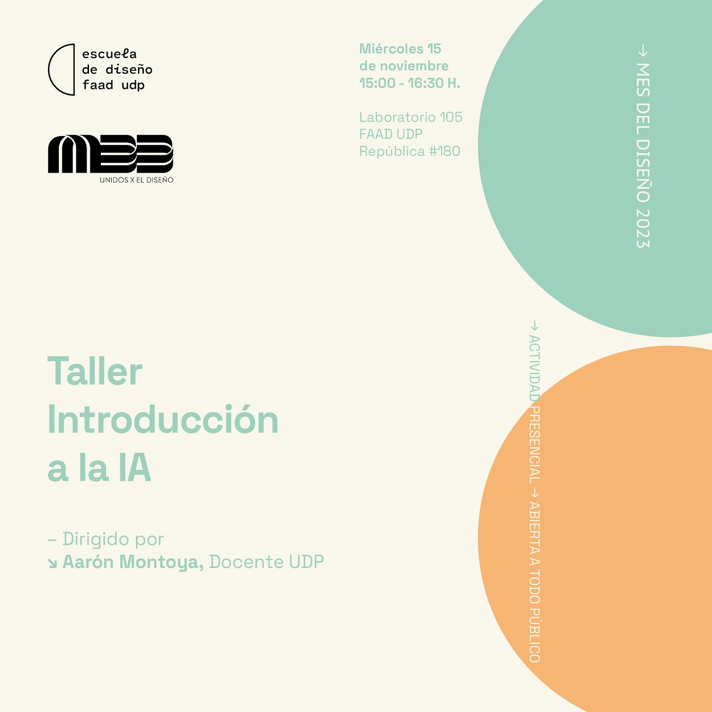

# 2023-taller-mes-diseno-intro-ia

## Acerca de

Este taller es dictado y escrito por [Aarón Montoya-Moraga](https://github.com/montoyamoraga) y [Vale Montecinos](https://github.com/menteneon), con gestión organizacional de Merry Faúndez, en el contexto del mes del diseño en Chile, 2023, con el apoyo de [Diseño UDP](https://github.com/disenoUDP).

## Invitación en redes sociales

## Proyectos

* [proyectos/00-vacio/](./proyectos/00-vacio/index.html)
* [proyectos/01-deteccion-imagen/](./proyectos/01-deteccion-imagen/)
* [proyectos/02-camara-entrenable/](./proyectos/02-camara-entrenable/)
* [proyectos/03-regresion-imagenes/](./proyectos/03-regresion-imagenes/)
* [proyectos/04-char-rnn-texto/](./proyectos/04-char-rnn-texto/)

## Bibliografía

- Andreas Refsgaard [https://www.andreasrefsgaard.dk/](https://www.andreasrefsgaard.dk/)
- Casey Reas [https://reas.com/](https://reas.com/)
- Daniel Shiffman [https://thecodingtrain.com/](https://thecodingtrain.com/)
- Gene Kogan [https://genekogan.com/](https://genekogan.com/)
- Hexorcismos [https://www.instagram.com/hexorcismos/](https://www.instagram.com/hexorcismos/)
- Hypereikon [https://www.instagram.com/hypereikon/](https://www.instagram.com/hypereikon/)
- Inteligencia Artificial para diseñadores [https://github.com/disenoUChile/audiv027-2023-2](https://github.com/disenoUChile/audiv027-2023-2)
- Introduction to Machine Learning for Arts [https://github.com/ml5js/Intro-ML-Arts-IMA-F23](https://github.com/ml5js/Intro-ML-Arts-IMA-F23)
- Machine Learning 4 Art [https://ml4a.net/](https://ml4a.net/)
- Machine Learning for Musicians and Artists [https://www.kadenze.com/courses/machine-learning-for-musicians-and-artists/](https://www.kadenze.com/courses/machine-learning-for-musicians-and-artists/)
- Making Pictures With Generative Adversarial Networks por Casey Reas [https://www.anteism.com/shop/making-pictures-with-generative-adversarial-networks-casey-reas](https://www.anteism.com/shop/making-pictures-with-generative-adversarial-networks-casey-reas)
- Maya Man [https://mayaontheinter.net/](https://mayaontheinter.net/)
- ml5.js [https://ml5js.org/](https://ml5js.org/)
- ml5 playful examples por Andreas Refsgaard [https://ml5-fellowship-2020.github.io/examples/](https://ml5-fellowship-2020.github.io/examples/)
- Nushin Yazdani [https://nushinyazdani.com/](https://nushinyazdani.com/)
- p5.js [https://p5js.org/](https://p5js.org/)
- RunwayML [https://runwayml.com/](https://runwayml.com/)
- Sofía Crespo [https://sofiacrespo.com/](https://sofiacrespo.com/)
- Teachable Machine [https://teachablemachine.withgoogle.com/](https://teachablemachine.withgoogle.com/)
- TensorFlow [https://www.tensorflow.org/](https://www.tensorflow.org/)
- Wekinator [https://wekinator.org/](https://wekinator.org/)
- Yining Shi [https://1023.io/](https://1023.io/)

## Licencia

MIT
